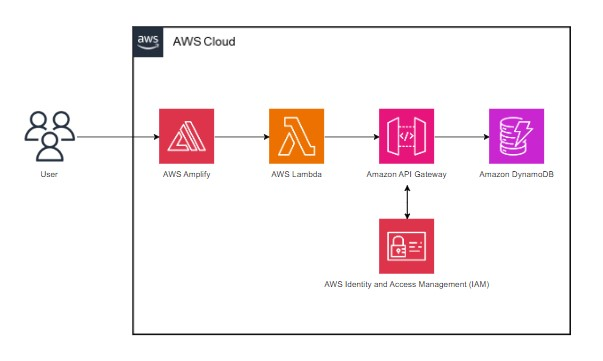
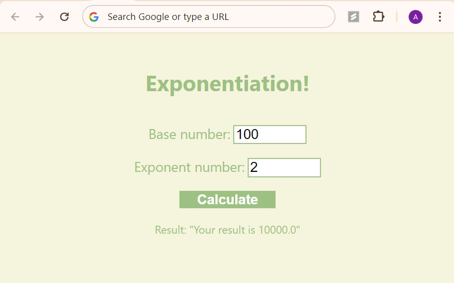

# Exponentiation with AWS

This is a simple web application that allows users to perform exponentiation - computing the power of a base number to an exponent. It's designed as a demonstration of integrating various Amazon Web Services (AWS) services to create a serverless application that's scalable and easy to deploy.

## Features

- **User Input for Base and Exponent**: Users can enter a base number and an exponent to compute the power operation.
- **Serverless Architecture**: Utilizes AWS services for a fully serverless operation, ensuring scalability and low maintenance.

## Architecture

The application uses the following AWS services:

- **AWS Amplify**: Automates the deployment and hosting of the web application.
- **AWS Lambda**: Executes the backend logic without provisioning or managing servers.
- **Amazon API Gateway**: Manages the APIs that trigger AWS Lambda functions.
- **Amazon DynamoDB**: Stores and retrieves data required by the application.
- **AWS IAM (Identity and Access Management)**: Manages access to AWS services and resources securely.

## Setup and Deployment

### Prerequisites

- AWS Account - Ensure that you have an AWS account set up. If not, you can create one at [AWS](https://aws.amazon.com/).
- AWS Free Tier - This project can be deployed within the AWS Free Tier limits.
- Basic knowledge of AWS services.
- Programming languages - Python, HTML/CSS, JavaScript.

### Steps

1. **AWS Console Setup**:
   - Log in to the AWS Management Console.
   - Navigate to the respective service sections (Amplify, Lambda, API Gateway, DynamoDB, IAM) to configure and deploy each component.

2. **Deploying the Web Application**:
   - **AWS Amplify**:
     - Create a new Amplify project and link it to your GitHub repository containing the web application's code or manually upload the zip folder containing 'amplify_Index.html'.
     - Make sure to replace the placeholder with your API link.
     - Deploy the application; Amplify will automatically build and host your application.
     
3. **Setting Up the Backend**:
   - **Amazon API Gateway**:
     - Create a new API using the Amazon API Gateway service.
     - Define a new resource and method (POST) that triggers the AWS Lambda function.
     - Navigate to '/' and enable Cross-Origin Resource Sharing (CORS).
   - **AWS Lambda**:
     - Create a new Lambda function using 'lambda_Function.py' as the code for computing power.
     - Replace the placeholder with your table name.
     - Test and deploy the Lambda function.
   - **Amazon DynamoDB**:
     - Create a new table to store the results.
     - Navigate to Configuration > Permissions > Policy, this will redirect you to IAM.
   - **IAM Configuration**:
     - Use 'dynamoDb_Policy.json' to configure a new policy for the table.
     - Make sure to replace the placeholder with your table ARN.

### Usage

- Access the web application hosted by AWS Amplify via the URL provided after deployment.
- Enter the base number and exponent in the provided fields and click "Calculate" to see the results.

## Resources

The below resources were utilized to successfully implement this project. 
- [Architect and Build an End-to-End AWS Web Application](https://youtu.be/7m_q1ldzw0U?si=sSoCqLKHFZttdpRr)
- [Build a Basic Web Application](https://aws.amazon.com/getting-started/hands-on/build-web-app-s3-lambda-api-gateway-dynamodb/)

## Support

For any queries or issues, refer to the AWS documentation or use the AWS Support Center.

Thank you for exploring this repository!
